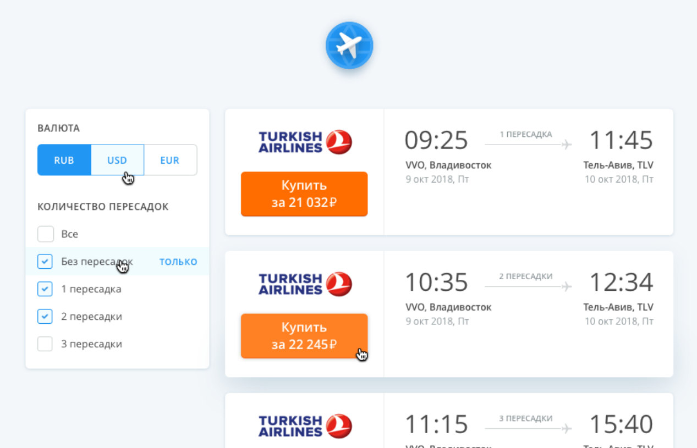

# Tickets Filtering App

A simple React-based tickets filtering application built as a test task. The app allows users to filter tickets by transfer options and switch between different currencies.

---

## Features

- **React with Vite**: Fast development and build environment.
- **TypeScript**: Ensures type safety throughout the project.
- **Tailwind CSS**: Provides a utility-first CSS framework for styling.
- **Zustand**: Lightweight state management for managing app state.
- **Unit Testing**: Includes simple unit tests using Jest.

---

## Installation

1. Clone the repository:
   ```bash
   git clone <repository-url>
   cd <repository-directory>
   ```

2. Install dependencies:
   ```bash
   npm install
   ```

---

## Scripts

| Script           | Description                                     |
|------------------|-------------------------------------------------|
| `npm run dev`    | Starts the development server.                  |
| `npm run netdev` | Starts the server accessible over the network.  |
| `npm run build`  | Builds the app for production.                  |
| `npm run preview`| Previews the production build locally.          |
| `npm run test`   | Runs the Jest test suite.                       |

---

## Features Overview

1. **Ticket Filtering**:
    - Filter tickets by the number of transfers. Filtering was made using a pseudo-server filtering approach

2. **Currency Switching**:
    - Switch between different currencies for ticket prices.

3. **Neat preloader**:
    - While tickets are being loaded, a neat preloader is displayed.

4. **Company logo**:
    - If the company logo is not provided in the data, a default logo is displayed

5. **Responsive Design & Neat transitions**

---


## How to Run

1. Start the development server:
   ```bash
   npm run dev
   ```

2. Build the app for production:
   ```bash
   npm run build
   ```

3. Run the production build locally:
   ```bash
   npm run preview
   ```

4. Run the test suite:
   ```bash
   npm run test
   ```

---

## Original task


You need to create a ticketing page with filters (as in the mockup below).
below).
The following tasks should be performed:
1. Ticket renderer (#task1)
Use React to render tickets with data,
sorted by price, from the tickets.json file
2. Ticket Filtering (#task2)
Filter tickets in the output by number of connections.
Conditions must be met when executing tasks:
- Use JavaScript/TypeScript;
- Work in browsers: IE 11, Chrome;
For convenience you can use any auxiliary
libraries. Conformity to the sample layout in the picture and
any additional features of the application are welcome.

## Mockup


---

## License

This project is for test purposes only.
